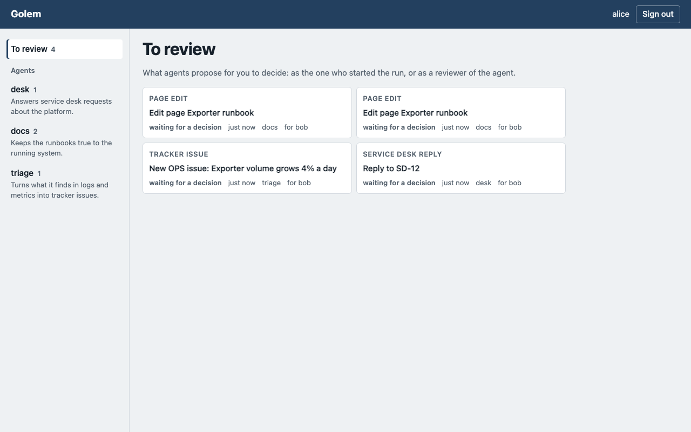
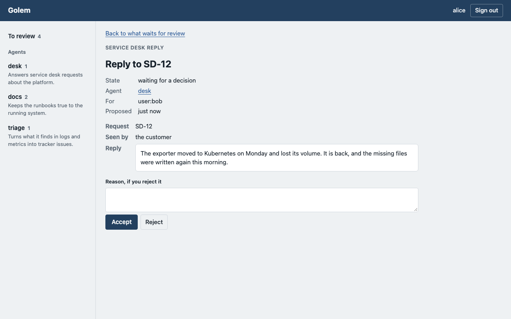
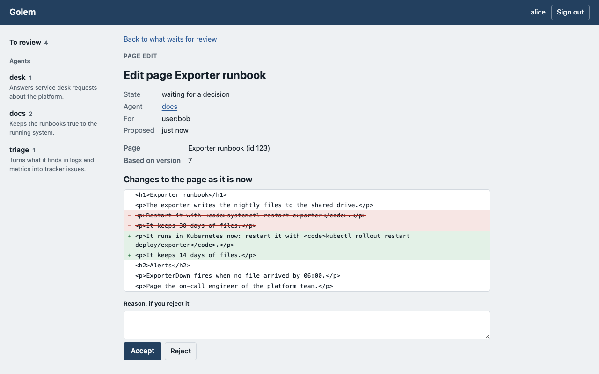

# Golem

On Monday the platform team moved the exporter to Kubernetes. By Wednesday three pieces of
work were waiting for Alice, who is on call. A customer wrote in the service desk (`SD-12`) that
the export files have been missing since Monday. The runbook in Confluence still told people to
restart the exporter with `systemctl`. And the exporter's new volume was growing 4% a day,
which nobody had filed.

None of it is code, and all of it is text a language model drafts in a minute. Still, nobody
lets a model write to customers or rewrite the runbook unchecked. A wrong reply goes to a
customer, and a wrong runbook misleads whoever is paged next. So the drafts don't get written,
or Alice writes all three herself.

Golem is a runtime for agents built for this situation. **The agent drafts, a person decides,
and the platform writes.** The agent never holds the keys to Confluence, the service desk or
Jira. The platform writes only what a person accepted, exactly as they saw it, and records who
accepted it.

The name comes from Borges' poem: a clay figure brought to life by a written word. Here the word
is the catalog, and the figure is stopped by the platform, not by the model.

## What Alice sees

Alice did not start these runs; a colleague did. But the three agents' catalogs name her as a
reviewer, so their proposals wait for her in **To review** on the board, across agents.



The `desk` agent's reply to `SD-12` says who will read it, the customer, and what it says. The
text is shown as plain text, never rendered, because it was written by a model in an untrusted
sandbox.



She accepts. The service desk write server posts the reply with its own account, and the audit
log records that Alice accepted it and the digest of the text she saw. If the service desk is
slow to answer, the platform tries again, and looks for the reply first, so the customer does
not get it twice.

The `docs` agent's runbook edit is shown as a diff against **the page as it is now**, not as it
was when the agent read it. The platform reads the live page itself for this, so a run cannot
hide what its edit removes.



If a colleague edited the runbook in the meantime, accepting writes nothing: the proposal ends
`stale`, and the next run drafts again from the current page. Merging two versions of prose is
work for a person, not for the platform. The `triage` agent's issue about the volume is accepted
the same way and created in Jira with a label that keeps a retry from filing it twice.

Agents that work on code or on records in Git end the same way, as a merge request a person
merges or closes in GitLab. Every result waits for a person in one place, with one set of
states. The guide for reviewers: [docs/guide/reviewing-proposals.md](docs/guide/reviewing-proposals.md).

To see this on your machine, with Confluence, the service desk and Jira faked:

```sh
uv run python scripts/ui_demo.py --proposals   # then open http://localhost:8090 as alice
```

## Why the agent cannot write by itself

- **Everything inside a run is untrusted.** A run is a short-lived Kubernetes Job with
  default-deny egress and one Git token that can push a branch and nothing else
  ([ADR 0004](docs/adr/0004-security-boundary-outside-the-job.md),
  [ADR 0007](docs/adr/0007-run-tokens.md)). What leaves the Job is a branch.
- **Reads go through platform MCP servers** that hold the secrets, accept only the run's token
  and audit every call ([ADR 0008](docs/adr/0008-platform-mcp-servers.md)).
- **Writes go through separate write servers** that no Job can reach. Only the task service
  calls them, with a token that names the person who decided and the digest of the payload
  they saw, valid only while the proposal is `accepted`
  ([ADR 0015](docs/adr/0015-proposals.md)).
- **The edge fails closed.** What it could not verify, it does not pass.
- **An agent changes through the same gate as code.** An agent is text in Git: roles, skills
  (`SKILL.md`), permissions, reviewers. Every merge request to a catalog is evaluated against
  a golden set, and below the threshold the pipeline fails
  ([ADR 0006](docs/adr/0006-evaluation-in-ci-first.md)).

## How it is built

A2A 1.0 is the only way in and the way agents call each other; MCP for tools (2026-07-28 is the
target; the Python SDK in use speaks up to 2025-11-25,
[ADR 0001](docs/adr/0001-industry-standards-and-a2a.md)); Agent Skills for agent descriptions;
OIDC/OAuth 2.0 with RFC 8693 token exchange for identity; OpenTelemetry GenAI conventions and
W3C Trace Context for traces; an OpenAI-compatible model API through a LiteLLM gateway.

| Container | State | Responsibility |
| --- | --- | --- |
| A2A edge | none | the only door: signed agent cards, the directory of agents, authentication, token exchange, chain policy, per-caller rate limit, audit |
| Task service | `golem_tasks` | A2A task lifecycle, push notifications, resume after a human answer; decides and applies proposals |
| Orchestrator | `golem_runs` | run admission and quotas; runs, processes and evaluation; Jobs; merge requests and proposals |
| Runtime Job | none (ephemeral) | one image for every agent: loads the catalog, runs the lead and roles, writes a branch |
| Web UI and board | `golem_ui` | sign-in and sessions, and a React board over the edge with the user's own token ([ADR 0018](docs/adr/0018-board.md)) |
| Channel adapters | none | Jira labels and Mattermost's `/golem`, as A2A clients |
| Platform MCP servers | none | read tools for Jira and Confluence; run tokens only |
| Write MCP servers | none | apply accepted proposals to Confluence, the service desk and Jira; proposal tokens from the task service only |
| Postgres cluster | `golem_tasks`, `golem_runs`, `golem_audit`, `golem_ui` | one cluster, one owner per database, an insert-only audit log |

A run, end to end:

1. A client sends an A2A `SendMessage` to the edge with a bearer token and the agent as `tenant`.
2. The edge verifies the token, checks the chain policy, writes an audit row and forwards it.
3. The task service creates the task; the orchestrator records the run once per (caller,
   message id), admits it within the caller's and the chain's limits and launches a Job.
4. In the Job, the runtime clones the agent's catalog and context repository, asks the lead for
   the next role and target, runs the role, validates its change and pushes
   `golem/<target>/<run>`.
5. The reconciler sees the Job finish, opens a merge request or records a proposal, and tells
   the task service, which completes or fails the task with the reason.

Diagrams: [docs/architecture.md](docs/architecture.md). Decisions: [docs/adr](docs/adr). What is
in the pilot and what is left for the target: [ADR 0005](docs/adr/0005-pilot-and-target.md).

## Status

Not deployed. The run lifecycle, proposals and their write servers, the channel adapters, the
web UI and the evaluation gate are implemented and tested: Postgres and Kubernetes parts
against real Postgres 17 and k3s in testcontainers, git against real repositories, the model,
GitLab, Jira, Confluence, Mattermost and the identity provider faked at their HTTP boundaries.
The manifests are applied to k3s in tests, network policies with real traffic. Not built yet:
the extended Agent Card, the GitLab adapter, the GitLab MCP server, the alert and schedule
triggers ([ADR 0017](docs/adr/0017-triggers.md)), the orchestrator's evaluation workflow with a
model judge and trace store, and Temporal (target).

## Documentation

| You want to | Read |
| --- | --- |
| get a first result from the board | [Getting started](docs/guide/getting-started.md) |
| decide what agents propose | [Reviewing proposals](docs/guide/reviewing-proposals.md) |
| start runs from Jira or Mattermost | [Channels](docs/guide/channels.md) |
| write an agent and its golden set | [Writing an agent](docs/guide/writing-an-agent.md), [the golden set's format](examples/discovery/evals/README.md) |
| install Golem on a cluster | [Install](docs/operations/install.md), [Kubernetes manifests](deploy/k8s/README.md) |
| look up a setting, a metric or an alert | [Configuration](docs/operations/configuration.md), [Metrics and alerts](docs/operations/alerts.md) |
| everything else | [docs/README.md](docs/README.md) |

## Working on Golem

Requires [uv](https://docs.astral.sh/uv/) and Docker.

```sh
uv sync
uv run pre-commit install    # ruff, YAML/TOML, private keys on every commit; CI runs the same
uv run pytest               # needs Docker: Postgres tests run in testcontainers
uv run ruff check .
docker compose -f deploy/compose.yaml up --build
GOLEM_SMOKE=1 uv run pytest tests/test_compose_smoke.py   # builds, starts and removes compose
uv run playwright install --only-shell chromium   # once, for the web UI in a browser
uv run pytest -m e2e        # the image as a Job in k3s, the UI in Chromium; about two minutes
```

The e2e suite (`tests/e2e`) is excluded from a plain `pytest` and runs in CI after the checks
pass. It imports the image into k3s and launches real runs through `KubernetesJobLauncher`
against a scripted model server: one that proposes a branch with only the Evidence section
changed, and three against a gateway that answers garbage, megabytes or nothing, each of which
must fail with nothing pushed. `tests/e2e/test_ui_browser.py` drives the web UI in headless
Chromium against the demo stack.

One image, seven processes: `python -m golem.edge`, `python -m golem.tasks`,
`python -m golem.orchestrator.reconciler`, the channel adapters `python -m golem.adapters jira`
(the default without an argument) and `python -m golem.adapters mattermost`, an MCP server
`python -m golem.mcp` (read or write, one group per process), and the web UI
`python -m golem.ui`. Each reads `GOLEM_*` environment variables (`src/golem/settings.py`) and
refuses to start with a list of every missing one. Compose runs the first three, without
Kubernetes, GitLab or an identity provider: the task service refuses every run with that
reason, and the edge serves public agent cards on `http://127.0.0.1:8480` and answers 401 to
every call. Passwords in `deploy/` are placeholders for local development only.

The board without proposals: `uv run python scripts/ui_demo.py` seeds a task in every state,
`--processes` pins a process instead. `uv run python scripts/ui_screenshots.py` writes the
screenshots in `docs/images/ui/`. To work on the board itself, `npm run dev` in `board/` serves
it with Vite and proxies the API to a local UI (`GOLEM_BFF_URL`, default
`http://127.0.0.1:8000`); `npm run check` runs its type check, lint, unit tests and build.

Where things are:

```
src/golem/
  catalog.py               agent and process catalogs: schema and loading
  runtime/                 one Job = one run: the lead, the roles on deepagents, validation, git
  orchestrator/            admission, runs, Jobs, the reconciler, merge requests and proposals
  tasks/                   the A2A task service; deciding and applying proposals
  edge/                    the A2A edge: auth, chain policy, cards, audit, proposal routes
  mcp/                     platform MCP servers: read tools, write tools, their gate and audit
  adapters/                Jira and Mattermost as A2A clients
  ui/                      the web UI's backend-for-frontend
  evaluation/              the quality gate of catalog merge requests
  proposal_payload.py      a proposal's fields and files, checked one way in the Job and outside
board/                     the board: React, TypeScript, Vite
deploy/                    compose for local work, kustomize manifests for Kubernetes
examples/                  an example agent catalog with its golden set, a context repository
docs/                      guides, operations, architecture, decision records
```
