# Golem

Golem is a runtime for autonomous agents. An agent is a catalog of text in Git: roles, skills
(`SKILL.md`), permissions and a process file. A run is an A2A task that the platform executes in
a short-lived Kubernetes Job, and the result is a merge request that a human accepts or rejects.
The name comes from Borges' poem: a clay figure brought to life by a written word. Here the word
is the catalog, and the figure is stopped by the platform, not by the model.

## Principles

- **A standard at every boundary.** A2A 1.0 is the only entry and the way agents call each other;
  MCP for tools (2026-07-28 is the target; the Python SDK in use speaks up to 2025-11-25,
  [ADR 0001](docs/adr/0001-industry-standards-and-a2a.md)); Agent Skills for agent
  descriptions; OIDC/OAuth 2.0 with RFC 8693 token exchange for identity; OpenTelemetry GenAI
  conventions and W3C Trace Context for traces; an OpenAI-compatible model API through a
  LiteLLM gateway.
- **Everything inside a Job is untrusted.** The security boundary is outside it: default-deny
  egress, a branch-only Git token, platform MCP servers that hold the secrets.
- **The edge fails closed.** What it could not verify, it does not pass.
- **One owner per database.** One Postgres cluster, a database per owning service, an
  insert-only audit log.
- **Others' failures stay theirs.** Rate limits per caller, admission quotas per caller and per
  root chain, namespace quotas, timeouts and circuit breakers on outbound calls.
- **An agent changes through the same gate as code.** Every merge request to a catalog is
  evaluated against a golden set; below the threshold the pipeline fails.

## Containers

| Container | State | Responsibility |
| --- | --- | --- |
| A2A edge | none | the only door: signed agent cards, the directory of agents, authentication, token exchange, chain policy, per-caller rate limit, audit, outbound calls |
| Task service | `golem_tasks` | A2A task lifecycle: executor, store, push notifications, resume after a human answer |
| Orchestrator | `golem_runs` | run admission and quotas; run, process and evaluation workflows; Jobs; merge requests |
| Runtime Job | none (ephemeral) | one image for every agent: loads the catalog, runs the lead and roles, writes a branch, emits traces |
| Web UI | `golem_ui` | sign-in, agents, starting, listing and canceling one's own tasks; calls the edge with the user's own token |
| Channel adapters | none | Jira and GitLab webhooks, chat bot, all as A2A clients |
| Platform MCP servers | none | Jira, Confluence and GitLab tools; accept run tokens only; hold their own secrets; audit every decision |
| Postgres cluster | `golem_tasks`, `golem_runs`, `golem_audit`, `golem_ui` | one cluster, one owner per database |

Details and diagrams: [docs/architecture.md](docs/architecture.md). Decisions:
[docs/adr](docs/adr). Guides for users and operators: [docs/README.md](docs/README.md).

## Pilot and target

The pilot covers entry over A2A, Golem's own agents calling each other synchronously, results as
merge requests, and quality evaluation on catalog merge requests. The target adds agents of other
platforms in both directions, long agent-to-agent delegation with waiting on a child task,
Temporal for durable workflows, and confirmation before mutating operations through an A2A
extension. See [ADR 0005](docs/adr/0005-pilot-and-target.md).

## Repository layout

```
src/golem/
  catalog.py               agent catalog schema and loading
  runtime/lead.py          the lead: a pure function from a snapshot to the next role command
  runtime/snapshot.py      records of a context repository (Markdown + front matter) as a snapshot
  runtime/main.py          one Job = one run: clone, decide, brief, run the role, validate, push
  runtime/validate.py      checks a role's change before anything leaves the Job
  runtime/workspace.py     git operations (the token never appears in a URL or command line)
  runtime/deepagents_runner.py  a role on deepagents: no shell, writes only under its directory
  runtime/tools.py         a role's tools from platform MCP servers: registry, run token, limits
  orchestrator/admission.py  run admission: Job quotas per caller and per root chain
  orchestrator/runs.py       idempotent run start on Postgres (schema.sql)
  orchestrator/service.py    the task service's orchestrator port: record a run, launch its Job
  orchestrator/jobs.py       hardened Job manifests and the Kubernetes launcher
  orchestrator/reconcile.py  finished Jobs to run outcomes; the task notification outbox
  orchestrator/merge_requests.py  merge requests for succeeded runs (GitLab REST API)
  orchestrator/reconciler.py the reconciler process: a reconcile pass every interval
  settings.py              process settings parsed from the environment
  edge/policy.py           chain policy: allowed calls, depth, cycles, budget
  edge/cards.py            A2A Agent Cards generated from the catalog
  edge/card_signing.py     A2A 1.0 card signatures: sign, publish the key, verify
  edge/auth.py, audit.py, app.py  the A2A edge: JWT check, audit row, forwarding; fails closed
  tasks/                   A2A task service: tasks in golem_tasks; three listeners (A2A for the
                           edge, run keys and status for MCP servers, run outcomes for the reconciler)
  evaluation/              the quality gate of catalog merge requests: golden set, runs, gate, CLI
  adapters/common.py       what adapters share: service token, SendMessage, per-run push tokens
  adapters/jira.py         Jira adapter: signed label webhook to SendMessage, task push to a comment
  adapters/mattermost.py   Mattermost adapter: /golem slash command to SendMessage, push to a post
  ui/                      web UI, a backend-for-frontend: OIDC login with PKCE, sessions in golem_ui,
                           Jinja2 pages, A2A calls to the edge with the user's own token
  mcp/                     platform MCP servers: run token gate, audit, read-only Jira and Confluence tools
  jwks.py                  signing keys from a JWKS URL, shared by the edge and the MCP servers
  ratelimit.py             token bucket rate limits per key, and the client address behind proxies
  metrics.py               Prometheus metrics: RED per listener by route template, run, reconciler
                           and guard metrics with bounded labels, the /metrics app
  serving.py               several uvicorn listeners in one process: the public ports and metrics
deploy/
  compose.yaml             local Postgres, edge, task service and reconciler
  k8s/                     kustomize manifests: namespaces, RBAC, workloads, network policies;
                           overlays for External Secrets and the Prometheus Operator, and an
                           example of an environment's overlay
  postgres/init.sql        databases, roles and grants
examples/
  discovery/               an example agent catalog: kinds, roles, rules, role instructions
  discovery/evals/         its golden set; discovery/.gitlab-ci.yml runs the gate on merge requests
  context/                 an example context repository the discovery agent works on
  mcp-registry.yaml        an example platform MCP registry for the discovery roles
scripts/
  ui_demo.py               the web UI with seeded tasks on localhost, to look around
  ui_screenshots.py        the screenshots in docs/images/ui
tests/support/             the fake identity provider and the UI demo stack, shared with scripts/
docs/
  README.md                index of the guides
  architecture.md          C4 diagrams (PlantUML)
  adr/                     architecture decision records
  guide/                   for users: getting started, reviewing proposals, channels, writing an agent
  operations/              for operators: install, configuration, security, backup, upgrade,
                           alerts, runbooks, troubleshooting
  images/ui/               screenshots of the web UI
Dockerfile                 one image; the container role is chosen by the command
```

## Development

Requires [uv](https://docs.astral.sh/uv/) and Docker.

```sh
uv sync
uv run pre-commit install    # ruff, YAML/TOML, private keys on every commit; CI runs the same
uv run pytest               # needs Docker: Postgres tests run in testcontainers
uv run ruff check .
docker compose -f deploy/compose.yaml up --build
GOLEM_SMOKE=1 uv run pytest tests/test_compose_smoke.py   # builds, starts and removes compose
uv run playwright install --only-shell chromium   # once, for the web UI in a browser
uv run pytest -m e2e        # the image as a Job in k3s, the UI in Chromium; about two minutes
```

The e2e suite (`tests/e2e`) is excluded from a plain `pytest` and runs in CI as a second stage
after the checks pass. It builds the image with `docker build`, imports it into the k3s
container with `ctr images import`, starts a `git daemon` with the example catalog (without MCP
tools) and context, and a scripted OpenAI-compatible model server from a ConfigMap. Then it
launches runs through `KubernetesJobLauncher`: one that proposes `golem/H-2/<run>` with only the
Evidence section changed, and three against a gateway that answers garbage, answers megabytes
or never answers, each of which must fail with nothing pushed. `tests/e2e/test_ui_browser.py`
drives the web UI in headless Chromium against the demo stack below: no console errors and no
CSP violation reports, golem.css applied, the security headers on every response, every link
answering, the form starting exactly one run, sign-out back on the landing page, and the task
list fitting a 390 px wide screen.

One image, seven processes: `python -m golem.edge`, `python -m golem.tasks`,
`python -m golem.orchestrator.reconciler`, the channel adapters
`python -m golem.adapters jira` (the default without an argument) and
`python -m golem.adapters mattermost`, a platform MCP server `python -m golem.mcp`, and the
web UI `python -m golem.ui`.
Each reads its settings from `GOLEM_*` environment variables (`src/golem/settings.py`) and
refuses to start with a list of every missing one; `deploy/compose.yaml` sets them all for the
first three. The adapters, the MCP servers and the UI are not in compose: they need Jira,
Confluence or Mattermost, and the adapters and the UI an identity provider.
Compose has no Kubernetes, GitLab or identity provider:
the task service runs with `GOLEM_KUBERNETES=none` and refuses every run with that reason, and
the edge cannot fetch signing keys, so it serves public agent cards on
`http://127.0.0.1:8480` (`GOLEM_EDGE_PORT`) and answers 401 to every call.

Passwords in `deploy/` are placeholders for local development only.

## Deploy

`deploy/k8s/base` deploys every process to Kubernetes with kustomize: `golem-system` for the
platform, `golem-jobs` for runs, default-deny network policies with explicit allows, and RBAC
that lets only the task service and the reconciler touch the Kubernetes API, neither able to
read a Secret. Secrets are not in git; an optional overlay creates them with the External
Secrets Operator. Secret names and keys, the placeholders to replace and how to apply:
[deploy/k8s/README.md](deploy/k8s/README.md). Decisions:
[ADR 0009](docs/adr/0009-deployment-on-kubernetes.md). From an empty cluster to a first run:
[docs/operations/install.md](docs/operations/install.md).

## A run, end to end

1. A client sends an A2A `SendMessage` to the edge with a bearer token and the agent as `tenant`.
2. The edge verifies the token, checks the chain policy, writes an audit row and forwards the call.
3. The task service creates the A2A task; the orchestrator records the run once per
   (caller, message id), admits it within the caller's and the chain's limits and launches a
   Kubernetes Job.
4. In the Job, the runtime clones the agent catalog and the context repository, asks the lead
   for the next role and target, runs the role, validates its change and pushes
   `golem/<target>/<run>`. The report goes to the pod's termination message.
5. The reconciler sees the Job finish, opens a merge request for the branch and tells the task
   service, which completes or fails the task with the reason.

A target stays pending while its proposal branch exists. Merged merge requests delete their
branch. A merge request closed without merging keeps it on purpose: deleting it would make the
lead propose the same target again. A rejected proposal is recorded as a status change on the
record, which is a human decision.

## Tools of a role

A role's `tools` in the catalog name tool groups of the platform's MCP registry, a YAML file
the platform mounts into the Job at `GOLEM_MCP_REGISTRY` (example:
[examples/mcp-registry.yaml](examples/mcp-registry.yaml)): group name to the server's
streamable HTTP URL and the tool names the group allows. A role gets exactly the groups it
names and, from each server, only the allowed tools. The run fails before the first model
call when a named group is missing from the registry, a server is down or lacks an allowed
tool, two of the role's groups offer the same tool name, or a tool would shadow a built-in
one (`execute` included). Every call carries `GOLEM_RUN_TOKEN` as a bearer token; the servers
hold the secrets to the systems behind them. A call is bounded by a timeout (the model gets
an error result) and a result by a size cap (cut with a `[truncated: ...]` marker); large
results that fit are offloaded to agent state, never to the clone.

The orchestrator issues the run token when it launches the Job ([ADR 0007](docs/adr/0007-run-tokens.md)):
ES256 with the key in `GOLEM_RUN_TOKEN_KEY_FILE` (`GOLEM_RUN_TOKEN_KID`), audience `golem-mcp`,
naming the run, agent, caller and root run, with the tool groups `GOLEM_AGENT_TOOLS_FILE` grants
the agent (`discovery: [tracker.read, wiki.read]`), and expiring a minute after the Job's
deadline. It reaches the Job through a Secret `golem-run-<run id>-token` owned by the Job, so it
is deleted with it. With `GOLEM_MCP_REGISTRY_CONFIGMAP` set, that ConfigMap is mounted
read-only as the registry.

Golem's own MCP servers (`python -m golem.mcp`, one process per group,
[ADR 0008](docs/adr/0008-platform-mcp-servers.md)) serve `tracker.read` (`search_issues`,
`get_issue`: Jira REST API v2) and `wiki.read` (`search_pages`, `get_page`: Confluence REST API
v1), read only, as compact text. A request is served only with a run token that verifies
against the task service's `GET /internal/run-keys`, grants the server's group, and names a
run that `GET /internal/runs/{run_id}` reports as `running` (cached for
`GOLEM_MCP_RUN_STATUS_TTL_SECONDS`, 10 s); anything else is 401 or 403, and a lookup that fails
is 503. Jira and Confluence are called with the server's own credentials, never the run token.
Every request writes one `audit_log` row (caller, tool, bounded arguments, a hash of the token,
allow or deny with the reason, root and run id) before it is served; without the audit log
nothing is served. Settings:
`GOLEM_MCP_GROUP`, `GOLEM_MCP_UPSTREAM_URL`, `GOLEM_MCP_UPSTREAM_TOKEN` (with
`GOLEM_MCP_UPSTREAM_USER` for Basic auth on Atlassian Cloud), `GOLEM_MCP_JIRA_DEPLOYMENT`
(`cloud` or `data-center`, for `tracker.read`), `GOLEM_TASK_SERVICE_URL`, `GOLEM_AUDIT_DSN`
(role `golem_mcp`), `GOLEM_MCP_KEYS_REFRESH_SECONDS`, `GOLEM_PORT`.

## Jira adapter

Putting a label on an issue starts an agent; the outcome comes back as a comment.

- **Jira webhook** (`POST /jira/webhook`): register a `jira:issue_updated` webhook with a
  secret. Requests without a valid `X-Hub-Signature: sha256=<hex HMAC-SHA256 of the body>` are
  refused with 401. `GOLEM_JIRA_LABELS_FILE` maps labels to agents (`golem:discovery: discovery`);
  other labels and removals are ignored.
- **To the edge**: `SendMessage` with the agent as `tenant`, message id
  `jira:<issue>:<label>:<webhook timestamp>` (a Jira retry starts no second run) and a push
  config pointing at `GOLEM_PUBLIC_BASE_URL/a2a/push` with a per-run token. The adapter
  authenticates with the client credentials grant against `GOLEM_OIDC_TOKEN_URL`; the edge sees
  it as `service:<GOLEM_OIDC_CLIENT_ID>`, which the call registry must allow for each mapped
  agent, and the token must carry the edge's audience.
- **Back to Jira** (`POST /a2a/push`): a terminal task state becomes one comment on the issue
  through the REST API v2 (`/rest/api/2/issue/{key}/comment`). Jira Cloud: set
  `GOLEM_JIRA_USER` to the account email and `GOLEM_JIRA_TOKEN` to its API token (Basic auth).
  Jira Data Center: leave `GOLEM_JIRA_USER` unset and put a personal access token in
  `GOLEM_JIRA_TOKEN` (Bearer).

The task service pushes only to URLs under its `GOLEM_PUSH_ALLOWED_PREFIXES`, so the
adapter's `GOLEM_PUBLIC_BASE_URL` must be under one of them.

Other settings: `GOLEM_EDGE_URL`, `GOLEM_OIDC_CLIENT_SECRET`, `GOLEM_JIRA_URL`,
`GOLEM_JIRA_WEBHOOK_SECRET`, `GOLEM_PUSH_TOKEN_SECRET`, `GOLEM_PORT`.

## Mattermost adapter

`/golem <agent> <goal>` in a channel starts an agent; the outcome comes back as a post in that
channel ([ADR 0010](docs/adr/0010-mattermost-adapter.md)).

- **Slash command** (`POST /mattermost/command`): create a custom slash command `/golem`
  pointing here and put its token in `GOLEM_MATTERMOST_COMMAND_TOKEN`. A request without
  `Authorization: Token <that token>` is refused with 401. Mattermost signs nothing else, so
  the NetworkPolicy admits only the Mattermost server, and the command works only in
  `GOLEM_MATTERMOST_TEAMS` (team ids) and, if set, `GOLEM_MATTERMOST_CHANNELS` (channel ids).
  `<agent>` must be in `GOLEM_MATTERMOST_AGENTS`; anything else gets a private usage reply.
- **To the edge**: `SendMessage` as `service:<GOLEM_OIDC_CLIENT_ID>` (client credentials, as
  for Jira), message id `mattermost:<hash of trigger_id>` (a replayed request starts no second
  run), the chat user's id and name in the message metadata and the goal text, and a push
  config with a per-run token naming the channel and the user. The user gets a private reply
  with the task id. The run's caller is the adapter, not the user: the edge cannot verify who
  typed the command (ADR 0010).
- **Back to Mattermost** (`POST /a2a/push`): a terminal task state becomes one post in the
  channel mentioning the user, with the state and the reason or the merge request URL, through
  `POST /api/v4/posts` with a bot account's access token (`GOLEM_MATTERMOST_BOT_TOKEN`). Add
  the bot to every allowed channel.

Other settings: `GOLEM_EDGE_URL`, `GOLEM_OIDC_TOKEN_URL`, `GOLEM_OIDC_CLIENT_SECRET`,
`GOLEM_MATTERMOST_URL`, `GOLEM_PUSH_TOKEN_SECRET`, `GOLEM_PUBLIC_BASE_URL`, `GOLEM_PORT`.

## Web UI

`python -m golem.ui` serves pages for people: sign in, see the agents, give one a goal, see
one's own tasks and cancel one ([ADR 0011](docs/adr/0011-web-ui.md)). It is a
backend-for-frontend: the browser gets pages and one cookie, never a token.

- **Sign-in**: OpenID Connect authorization code flow with PKCE S256, the UI a confidential
  client (`client_secret_basic`). `state`, `nonce` and the verifier are used once, expire after
  ten minutes and are bound to the browser that started the sign-in. The ID token's signature,
  issuer, audience, `azp`, expiry and nonce are checked.
- **Sessions** live in `golem_ui` (role `golem_ui`): the row is keyed by a hash of the cookie,
  and the access, refresh and ID tokens are encrypted with `GOLEM_UI_SESSION_KEY` (a Fernet
  key). The cookie is `__Host-golem-session` with `Path=/; Secure; HttpOnly; SameSite=Lax`. The
  access token is refreshed a minute before it expires; a failed refresh ends the session, and
  every session ends twelve hours after sign-in. Signing out deletes the session and, if the
  identity provider offers one, goes through its end-session endpoint.
- **To the edge**: `SendMessage`, `GetTask`, `ListTasks` and `CancelTask` with the user's own
  access token, so the run's caller is `user:<name>`; the call registry must allow `user:*`
  (or the users) for each agent in `GOLEM_UI_AGENTS`. The message id comes from a nonce in each
  rendered form, so a double submit starts one run. The access token must carry the edge's
  audience.
- **In the browser**: server-rendered Jinja2 with autoescape, no scripts, no third-party
  assets; every `POST` carries the session's CSRF token; every response has a strict
  Content-Security-Policy, `nosniff`, `Referrer-Policy: same-origin` and, over https, HSTS.

To look at it, `uv run python scripts/ui_demo.py` starts Postgres (testcontainers), the real
UI, edge and task service with a fake Job launcher, and a fake identity provider that signs in
`alice` without a password, then seeds a task in every state; open `http://localhost:8090`
(`--port` to change it). `uv run python scripts/ui_screenshots.py` runs the same stack with ids
and timestamps frozen and writes the screenshots below to `docs/images/ui/` (headless Chromium,
1280x800, the task list also 390x844; the same bytes on every run).

| | |
|---|---|
| 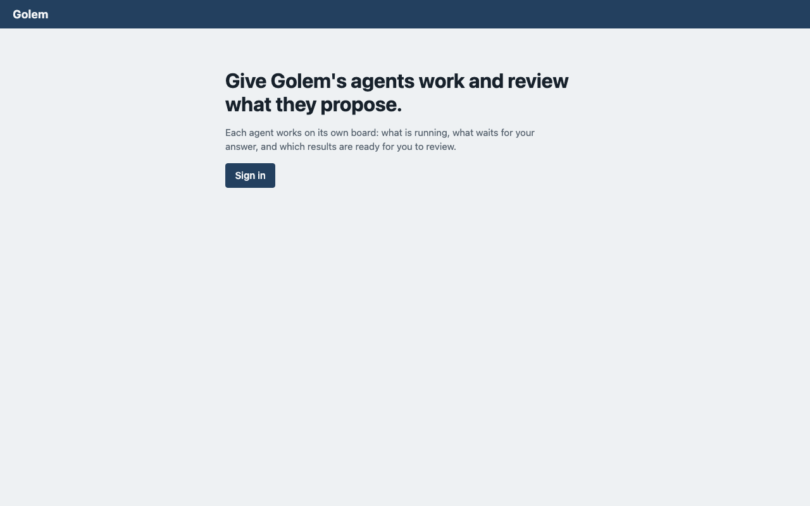 | 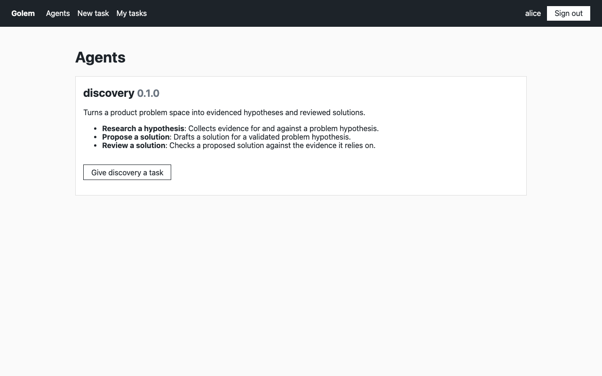 |
| 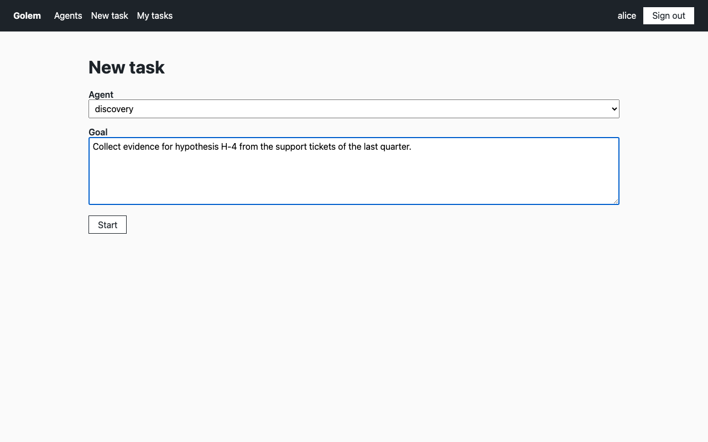 | 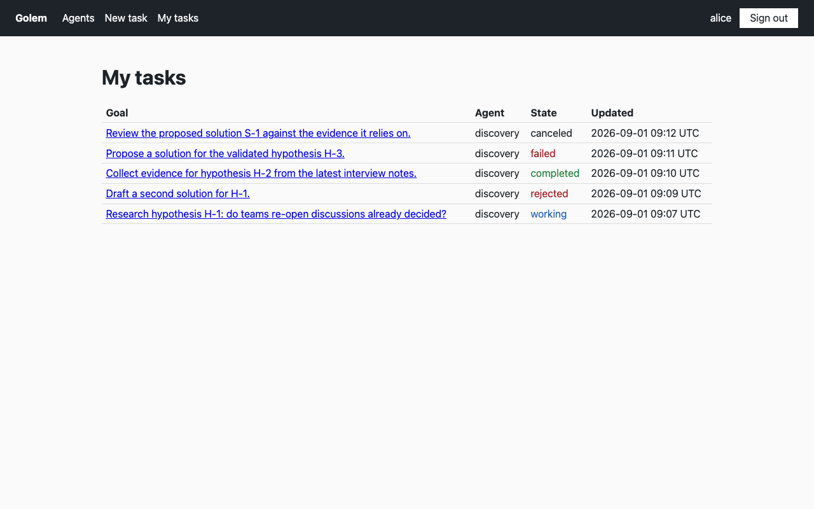 |
| 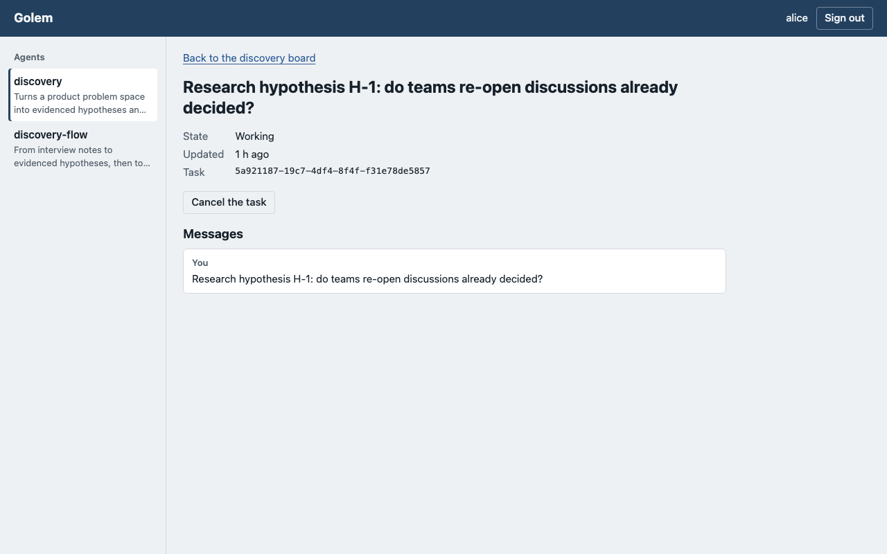 | 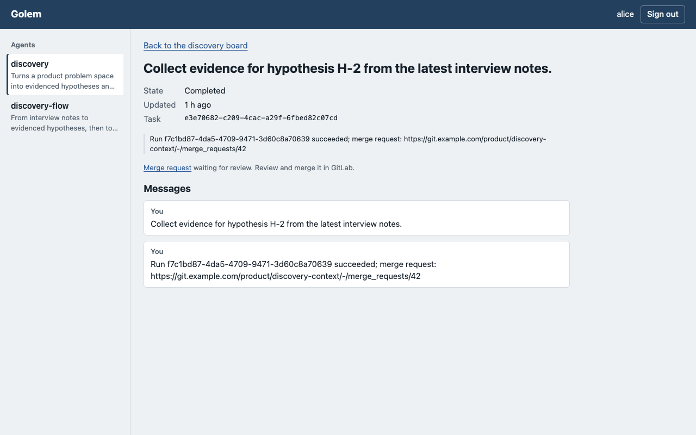 |
| 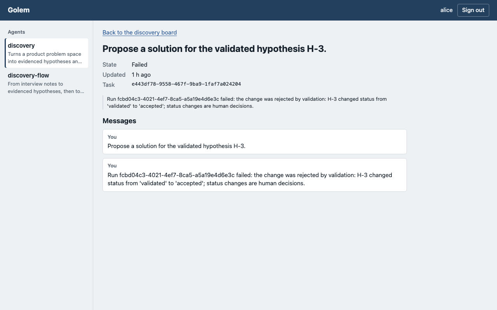 | 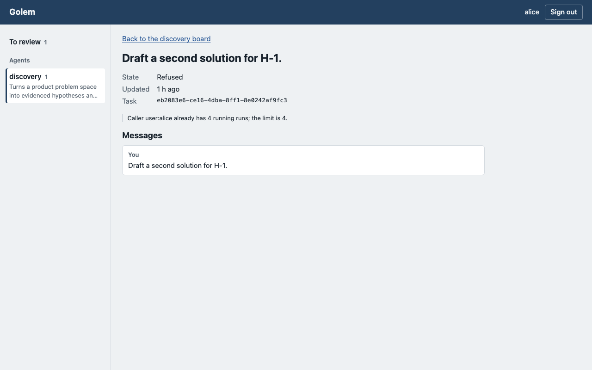 |
| 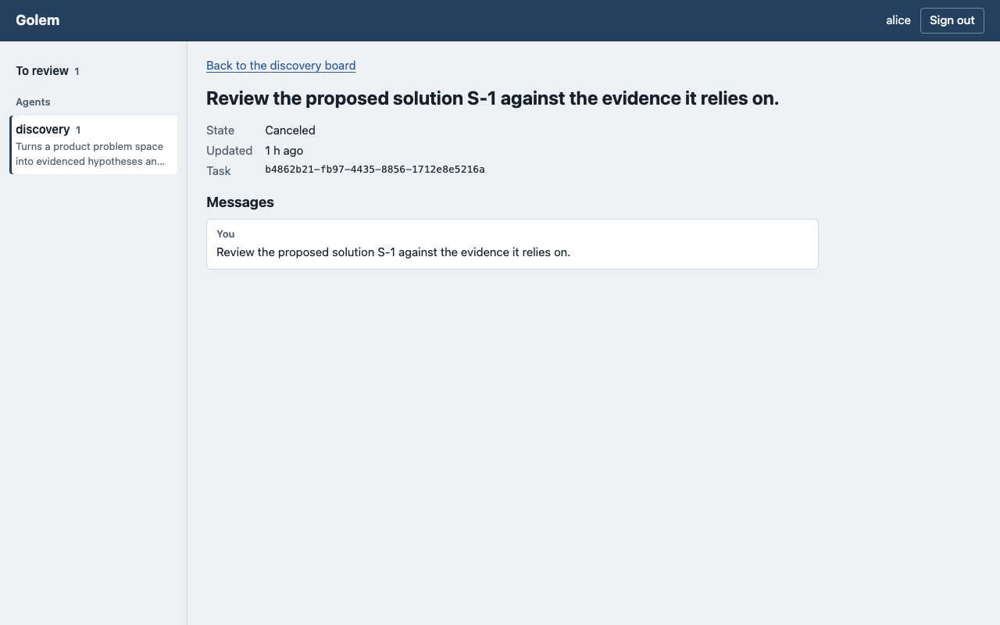 | 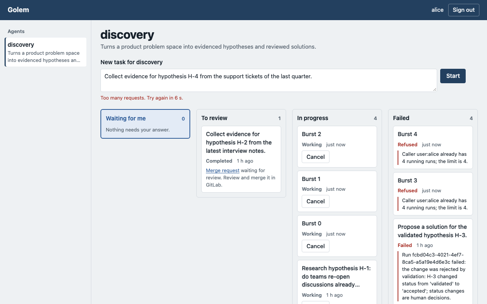 |

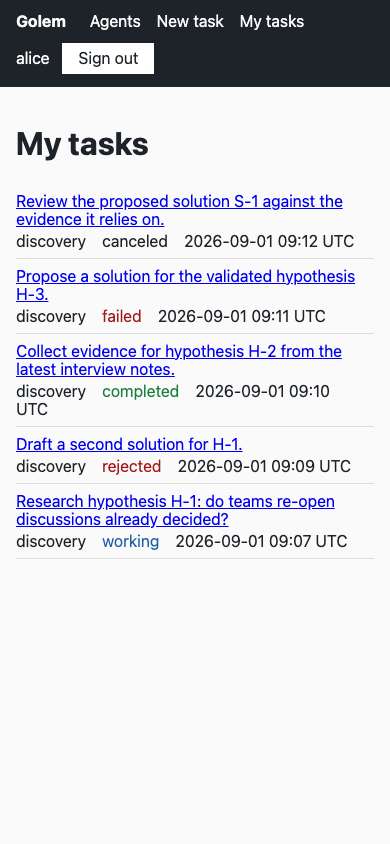

At the identity provider, register `GOLEM_OIDC_REDIRECT_URL` (`GOLEM_PUBLIC_BASE_URL` +
`/callback`) and `GOLEM_PUBLIC_BASE_URL` + `/` as the post-logout redirect URL.
Settings: `GOLEM_OIDC_ISSUER`, `GOLEM_OIDC_DISCOVERY_URL`, `GOLEM_OIDC_CLIENT_ID`,
`GOLEM_OIDC_CLIENT_SECRET`, `GOLEM_OIDC_REDIRECT_URL`, `GOLEM_EDGE_URL`, `GOLEM_UI_DSN`,
`GOLEM_UI_SESSION_KEY` (`python -c "from cryptography.fernet import Fernet;
print(Fernet.generate_key().decode())"`), `GOLEM_UI_AGENTS`, `GOLEM_PUBLIC_BASE_URL` (https, or
http on localhost), `GOLEM_PORT`.

## Rate limits

Every public entry point has a token bucket rate limit ([ADR 0012](docs/adr/0012-rate-limits.md)):
the edge per authenticated caller (60/min, burst 20) and per client address for failed
authentications, the MCP servers per address for failed authentications, the UI's `/login`
per address and starting tasks per session, the Jira webhook and the Mattermost command per
address before their secrets are checked. A refusal is 429 with `Retry-After`; a refused
authenticated call is audited once per streak as `deny: rate_limited`. The buckets live in
each replica, so a limit multiplies by the replicas; the admission quotas stay the hard limit
on runs. Behind an ingress controller, set `GOLEM_TRUSTED_PROXIES` to its addresses so the
client address is read from `X-Forwarded-For`. Settings and defaults:
[deploy/k8s/README.md](deploy/k8s/README.md#rate-limits-and-trusted-proxies).

## Metrics

Every process serves Prometheus metrics at `GET /metrics` on a port of its own
(`GOLEM_METRICS_PORT`, 9090), never on a port its callers use; only the namespace labelled
`golem.dev/monitoring: "true"` may reach it ([ADR 0013](docs/adr/0013-metrics.md)). Every HTTP
listener records the same RED metrics (`golem_http_requests_total`,
`golem_http_request_duration_seconds`) by route template, never by path. Domain metrics cover
runs (started, admission rejections, reserved cost, outcomes and duration per agent), the
reconciler (pass duration and errors, outbox and unsettled proposals, merge request failures)
and the guards (rate limit refusals, authentication failures, audit write failures, policy
denials, MCP tool calls). Label values come from closed sets: an unconfigured agent or tool is
`other`, and no principal, id, address or goal is ever a label. The metrics and alert examples:
[docs/operations/alerts.md](docs/operations/alerts.md).

## Evaluation of a catalog change

A merge request to an agent catalog runs `python -m golem.evaluation run` in the catalog
repository's CI ([ADR 0006](docs/adr/0006-evaluation-in-ci-first.md)). Each case of the golden
set in `evals/` is a context repository and a goal with what the run must produce: the outcome,
the role and target the lead picks, and checks on the proposal branch (sections filled, files
changed only under a directory, phrases present or absent). Every case runs through the same
`golem.runtime.main.run` a Job runs, against local bare repositories. The gate passes when the
pass rate reaches the threshold (0.8 by default) and no case that passed in `evals/baseline.json`
fails now; the exit code fails the pipeline, and "Pipelines must succeed" blocks the merge. The
format and the commands: [examples/discovery/evals/README.md](examples/discovery/evals/README.md).

## Status

Not deployed. The whole run lifecycle above is implemented and tested: Postgres and Kubernetes
parts against real Postgres 17 and k3s in testcontainers, git against real repositories, the
model and GitLab through fakes at their boundaries. The Kubernetes manifests are applied to k3s
in tests: RBAC through access reviews, network policies with real traffic. The Jira and
Mattermost adapters are tested against the real edge and task service (for Mattermost, the
push back from the task service too), with Jira, Mattermost and the identity provider faked at
their HTTP boundaries. The web UI is tested through the real edge and task service with its
sessions in real Postgres and the identity provider faked at its HTTP boundary.
The Jira and Confluence MCP servers are tested with the runtime's own MCP client against the
real task service and audit log, with Jira and Confluence faked at their HTTP boundaries.
The evaluation of catalog merge requests runs in the catalog's CI job, tested with fake roles
over the example golden set. Every process exports metrics, tested through its own app (and
the reconciler as a process); the network check proves on k3s that only the monitoring
namespace reaches the metrics ports. Not built yet: the extended Agent Card, the GitLab adapter, the GitLab MCP
server, the UI's decision queue, the orchestrator's evaluation workflow with a model judge and trace store, and
Temporal (target).
