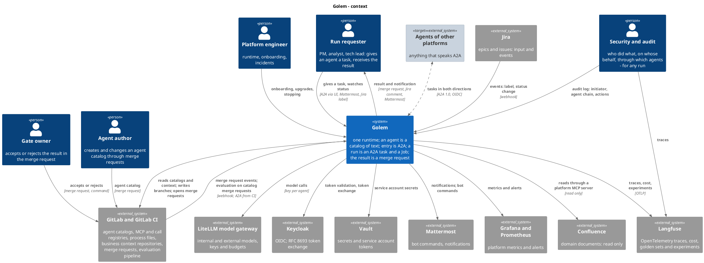
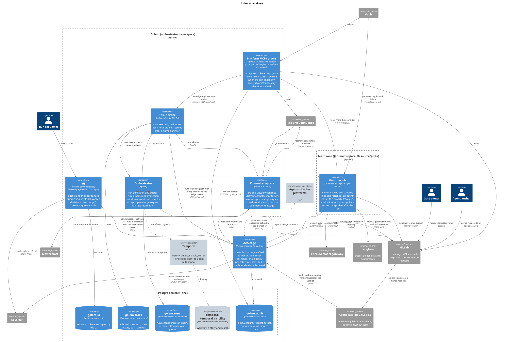
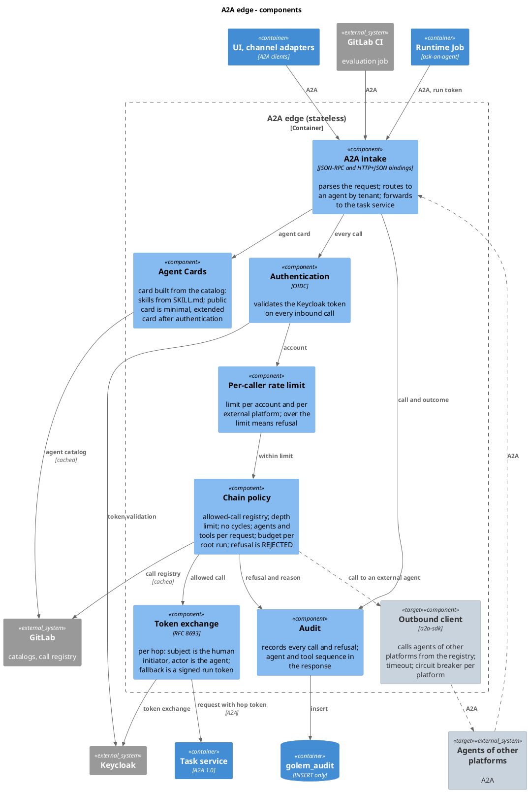
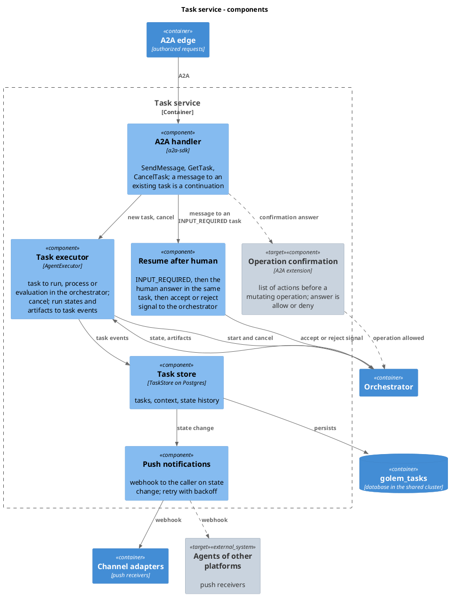
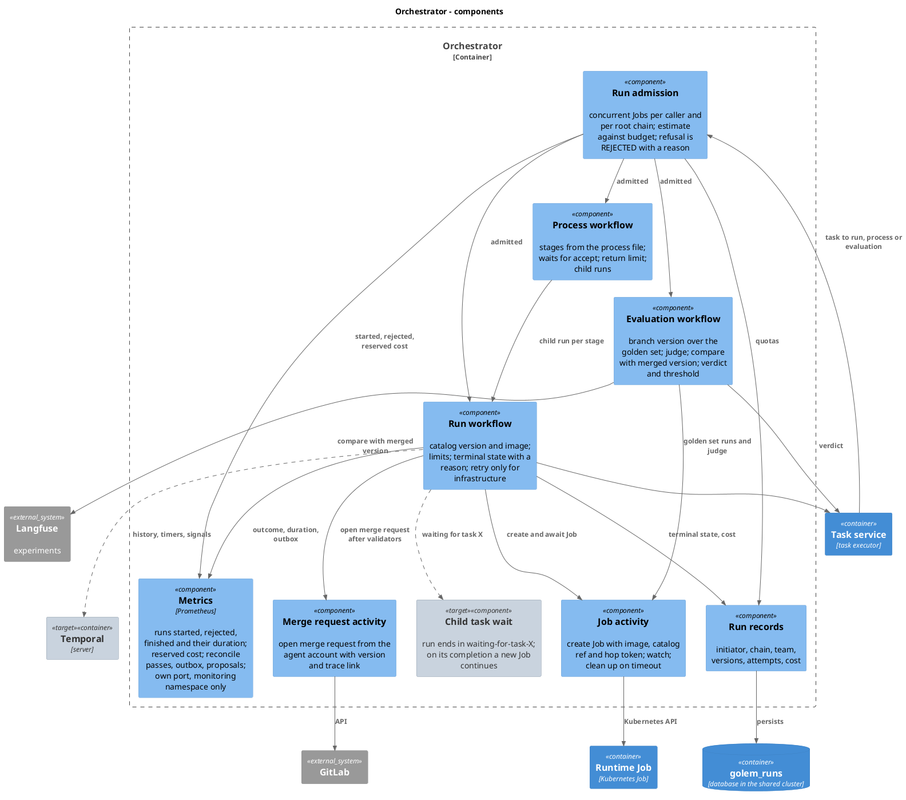
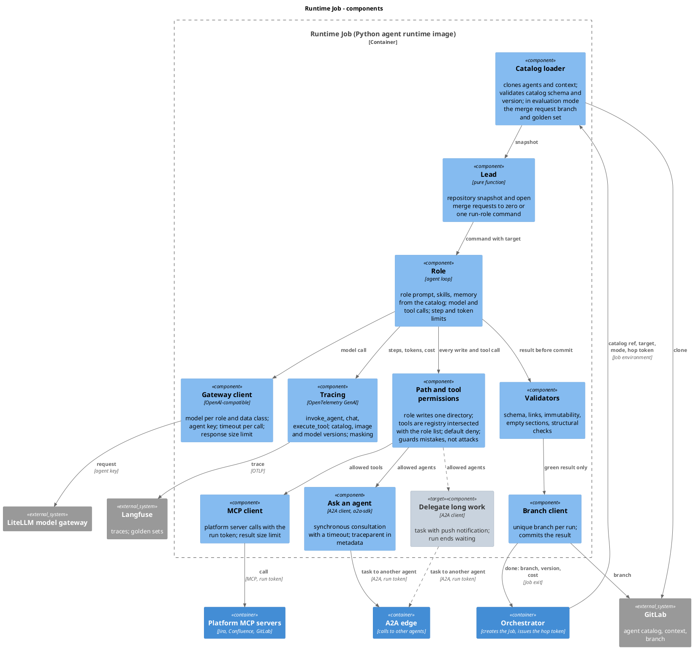

# Architecture

The intended architecture of Golem in C4 notation: context, containers, and components of the
four containers that matter most. There is no code level on purpose. Nothing here is deployed;
the run lifecycle, the Jira and Mattermost channel adapters and the web UI are implemented (see
the README), and evaluation runs in its pilot form in the catalog's CI job; the GitLab adapter
and the orchestrator's evaluation workflow are not.

**Pilot and target on the same diagrams.** Pale elements and dashed relationships are the
target picture and are not part of the pilot. Everything else is the pilot: entry over A2A,
Golem's own agents calling each other, results delivered as merge requests, and quality
evaluation on every merge request to an agent catalog. The target adds agents of other
platforms in both directions, long agent-to-agent delegation with waiting on a child task,
Temporal, and confirmation before a mutating operation through an A2A extension. See
[ADR 0005](adr/0005-pilot-and-target.md).

Diagrams use the C4 library bundled with PlantUML (`!include <C4/...>`).

## Level 1. Context

Five human roles, the organization's existing systems, and agents of other platforms. Golem
sits between them: it accepts tasks over A2A, reads agent catalogs and context from GitLab,
writes only branches and merge requests, calls models through a gateway, and leaves traces in
Langfuse.

## Level 2. Containers

Two trust zones: the orchestrator namespace, the shared part that holds no team data, and the
team's Jobs namespace, where a run lives.

**Everything inside a Job is untrusted.** A model drives it, and the agent library's path
permissions do not apply once the backend can execute shell commands. The security boundary
therefore runs outside the Job ([ADR 0004](adr/0004-security-boundary-outside-the-job.md)).
A default-deny network policy opens exactly five destinations to a Job: the A2A edge, the
model gateway, Langfuse, the platform MCP servers, and GitLab. The Job's GitLab token can
write only its own branch. Platform MCP servers (Jira, Confluence, GitLab) hold their secrets
themselves and accept calls authorized by the run token; the diagram folds them into one
container. Metrics in Grafana and Prometheus are omitted from the diagram: every process serves
them on a metrics port of its own that only the monitoring namespace reaches
([ADR 0013](adr/0013-metrics.md)).

**Platform MCP servers are resource servers for run tokens**
([ADR 0008](adr/0008-platform-mcp-servers.md)). One process serves one tool group over
streamable HTTP, read only. A gate in front of the MCP SDK verifies the run token against the
task service's JWKS, requires the server's group in the token's `tools`, asks the task service
whether the run is still running (cached for seconds), and writes an audit row for every
request, allowed or refused, before serving it. Anything it cannot check it refuses: no signing
keys, no run status, no audit row. Upstream calls carry the server's own credentials; the run
token never leaves the server.

**The A2A edge and the task service are two containers, not one gateway**
([ADR 0002](adr/0002-edge-and-task-service-split.md)).

| | A2A edge | Task service |
| --- | --- | --- |
| Does | protocol at the boundary, agent cards, authentication, token exchange, chain policy, per-caller rate limit, audit, outbound calls | task lifecycle: executor, task store, push notifications, resuming a task after a human answers |
| State | none; registries and cards are cached from GitLab | `golem_tasks` |
| On failure | **fails closed**: what it could not check, it does not pass. Keycloak or the call registry unavailable means rejection | tasks wait; the edge returns an error and clients retry |
| Changes | rarely; it is the security boundary | often, together with the orchestrator |

**One Postgres cluster, several databases, one owner each**
([ADR 0003](adr/0003-one-postgres-cluster-per-owner-databases.md)).

| Database | Owner | Other writers | Notes |
| --- | --- | --- | --- |
| `golem_tasks` | task service | none | receives input from agents of other platforms |
| `golem_runs` | orchestrator | none | cost, chain and quota accounting |
| `temporal`, `temporal_visibility` | Temporal | none | target only |
| `golem_audit` | a dedicated owner role that no service uses | A2A edge and MCP servers, `INSERT` only | `UPDATE`, `DELETE`, `TRUNCATE` are held by no service role |
| `golem_ui` | web UI | none | sessions; access, refresh and ID tokens encrypted with the UI's key |

**Protection from other parties' failures and overload** sits in four places, because every
incoming task spawns a Job in the team namespace:

- A2A edge: rate limit per caller;
- orchestrator: run admission with a limit on concurrent Jobs per caller and per root chain;
  refusal is `REJECTED` with a reason;
- Jobs namespace: `ResourceQuota` on Job count, CPU and memory as the last line;
- outbound calls to other platforms: timeout and circuit breaker, so a platform that stopped
  answering cannot hold Golem's Jobs.

**The Jira adapter is an A2A client like any other.** A label added to an issue arrives as a
`jira:issue_updated` webhook signed with a shared secret (`X-Hub-Signature: sha256=<HMAC of the
body>`); an unsigned or badly signed request is refused. A label from the mapping file becomes
a `SendMessage` to the edge as `service:<client id>` (OAuth 2.0 client credentials), with the
agent as `tenant`, a message id derived from the issue, the label and the signed timestamp, so
Jira's retries start one run, and a push notification config with a per-run token. A terminal
push becomes one comment on the issue: the comment carries the task id, and the adapter looks
for it before posting, so a repeated push does not comment twice and the adapter keeps no state.

**The Mattermost adapter is the same client with a weaker door**
([ADR 0010](adr/0010-mattermost-adapter.md)). A `/golem <agent> <goal>` slash command carries
only the command's shared token, so the token is compared in constant time and backed by a
NetworkPolicy that admits only the Mattermost server, team and channel allowlists and an
agent allowlist; the message id comes from Mattermost's per-invocation `trigger_id`. The run's
caller is `service:<client id>`; the chat user is in the message metadata and the goal, a
claim the edge cannot verify. A terminal push becomes one post in the channel mentioning the
user: the task service tells each task its outcome at most once, so the adapter keeps no
state and does no lookup.

**The UI is a backend-for-frontend that calls the edge as the user**
([ADR 0011](adr/0011-web-ui.md)). The user signs in with the OpenID Connect authorization code
flow and PKCE S256, the UI a confidential client; `state`, `nonce` and the verifier are single
use, expire in ten minutes and are bound to the browser by a `__Host-` cookie. Access, refresh
and ID tokens stay in `golem_ui`, encrypted with the UI's key; the browser holds only a random
session id in `__Host-golem-session` (`Secure`, `HttpOnly`, `SameSite=Lax`). Every A2A call
carries the signed-in user's own access token, so the edge, the audit log, admission and the
task store see `user:<name>`, not the UI; unlike the adapters, the UI has no identity of its
own at the edge. Pages are server-rendered with autoescape, no inline script and a strict CSP;
every `POST` carries the session's CSRF token. The edge forwards `ListTasks`, which the task
store answers with the caller's own tasks only.

## Level 3. A2A edge

Everything about the protocol at the boundary and trust between agents. The edge knows who is
calling, on whose behalf, and whether that is allowed; it does not know what an agent does or
what state a task is in. Any component that could not verify something refuses.

## Level 3. Task service

The A2A task lifecycle. An A2A task is the run: task states map onto run states, the result
comes back as a task artifact, and long runs answer with a push notification. The task service
takes A2A only from the edge, on a port of its own that also wants the edge's shared secret;
the MCP servers (run keys, run status) and the reconciler (run outcomes) each reach a separate
listener serving only their routes ([ADR 0009](adr/0009-deployment-on-kubernetes.md)). In the pilot the human answer is an accepted merge request: an
adapter receives the webhook and sends a continuation as an ordinary A2A message in the same
task.

## Level 3. Orchestrator

The orchestrator has no launch API, event receiver or token issuer of its own; those live in
the edge, the task service and the adapters. It owns execution: admission, workflows, Jobs,
merge requests, run records, metrics. In the pilot, workflows run as plain code over
`golem_runs`; in the target they move onto Temporal.

**Metrics** ([ADR 0013](adr/0013-metrics.md)). Admission counts started runs, rejections by
reason and the cost it reserves; whoever moves a run out of `running` (the reconciler from the
Job and its report, the task service on a cancel or a failed launch) records its outcome and its
duration from `runs.created_at`, once, through the guarded `UPDATE`. The reconciler times its
passes, counts failed ones and merge request failures, and gauges the outbox and the unsettled
proposals after every pass. Agent labels are bounded by configuration.

**Evaluation workflow.** A merge request to an agent catalog starts a GitLab CI pipeline. Its
job is an A2A client: it submits "evaluate this catalog version" and waits for the verdict. The
orchestrator runs the version from the merge request branch over the golden set, runs the judge
in the same runtime image, compares the scores with the last merged version in Langfuse
experiments, and returns the verdict as a task artifact. Below the threshold the CI job fails
and "Pipelines must succeed" blocks the merge. An agent changes only through the same gate as
code.

**Evaluation in the pilot.** Until this workflow exists, the CI job runs the evaluation itself
([ADR 0006](adr/0006-evaluation-in-ci-first.md)): `python -m golem.evaluation run` in the Golem
image runs every golden-set case through the runtime's own `run` against local bare
repositories, applies structural checks to the proposal branch (no judge, no Langfuse), and
fails the job when the pass rate is below the threshold or a case that passed in the baseline
fails. Moving it into a Job keeps the same command.

## Level 3. Runtime Job

One image for every agent and every mode: run, golden-set run, judge. The loader clones the
catalog named in the environment; the lead is a pure function over a snapshot; path and tool
permissions protect against model mistakes but are not a security boundary; validators let only
a green result into the branch.

The gateway is an integration point that can fail in every way a network peer can, so the
gateway client bounds it: each call times out (`GOLEM_MODEL_TIMEOUT_SECONDS`, 120 s by default,
retried twice by the client) and a reply that cannot be parsed or exceeds 1 MiB fails the run
with a reason naming the model response, before any tool call in it runs.

The whole Job is tested end to end in k3s (`tests/e2e`, run with `pytest -m e2e`): the image
built from the Dockerfile is imported into the cluster's containerd, the unmodified Job manifest
runs it under the restricted security context, the catalog and the context come from a
`git daemon` in the cluster, and a scripted OpenAI-compatible server plays the gateway, well and
badly: a normal run proposes the target's branch; a body that is not JSON, a reply of megabytes
and a gateway that never answers each fail the run by the runtime's own limits, with nothing
pushed.

## Not shown

- A second team zone: scaling out is another Jobs namespace with its own accounts, sharing the
  orchestrator namespace.
- Network policies as separate objects; they are described in text at level 2.
- How golden sets are collected and labelled: a process question, not an architectural one.

## Open questions

- **Delegation in the identity provider.** RFC 8693 delegation (the `act` claim) in Keycloak
  is a preview feature with open defects. If the deployed version cannot do it, the token
  exchange component uses the fallback: a signed run token carrying the chain.
- **`a2a-sdk` in the internal package mirror**, and whether the available version implements
  A2A 1.0. The A2A handler, the outbound client and ask-an-agent depend on it.
- **OTLP ingestion in the trace store.** Whether the deployed Langfuse accepts traces over OTLP,
  and whether its experiments are enough to compare a branch version with the merged one.
- **How a CI job obtains an identity token** for its A2A call: the GitLab CI job ID token
  exchanged at Keycloak, or a pipeline service account. Neither has been tried.
- **Backup regime for agent-produced data.** Physical backup and point-in-time recovery apply to
  the whole cluster; a stricter regime for one database needs an additional logical backup. Run
  artifacts live in GitLab, so the requirement may belong there instead.
- **Audit log immutability versus cluster admins.** `golem_audit` is insert-only through role
  grants; a cluster administrator can bypass that. If the organization's security requirements
  do not accept this, the log must also be shipped to a central log collection system.
- **Task service replicas.** In `a2a-sdk` 1.1.5 a live task is held in the memory of the replica
  that created it. With a shared task store, cancel from another replica works (probed with two
  app instances over one store: the task becomes CANCELED and the cancel reaches the
  orchestrator); what stays replica-bound is subscribing to the event stream, which Golem does
  not offer. Not yet checked: what happens to the stale live task left on the first replica.
- **Idempotent run start — implemented in `orchestrator/runs.py`.** A client that retries after
  a timeout sends the same `messageId`, and every retry becomes a new A2A task. `start_run`
  returns the existing run for the same (caller, message id) and never starts a second Job.
  Transaction-scoped advisory locks on the caller and the root chain serialize the check and the
  insert, and a unique key in `runs` backs them up. Tested against Postgres 17 in
  testcontainers, including concurrent retries and a burst at the caller limit; with the locks
  removed exactly those two tests fail. Idempotent handling is "the correct first step in dealing
  with repeat messages" (*Cloud Architecture Patterns*, p. 34). Still open: wiring the task
  service to `start_run`, and where the cost estimate comes from.
- **Merge requests and the notification outbox — implemented in `orchestrator/reconcile.py` and
  `orchestrator/merge_requests.py`.** A succeeded run's result is branch
  `golem/<target_id>/<run_id>` in the agent's context repository. The reconciler, not knowing
  the target, finds the branch through the GitLab branches API (`search=/<run_id>$`, the exact
  shape checked locally) and opens the merge request idempotently: an open merge request for
  the source branch is reused, so a crash between opening it and recording it opens nothing
  twice. No branch means the run proposed nothing, and the task hears so. A succeeded run's
  tasks are notified only after its proposal is settled (`runs.proposal_settled_at`); while
  GitLab fails, the run stays unsettled, is retried every pass, and its notifications wait.
  A run whose agent has no configured GitLab project is settled with that reason instead of
  being retried, and the edge verifies tokens, key refetches included, off its event loop.
