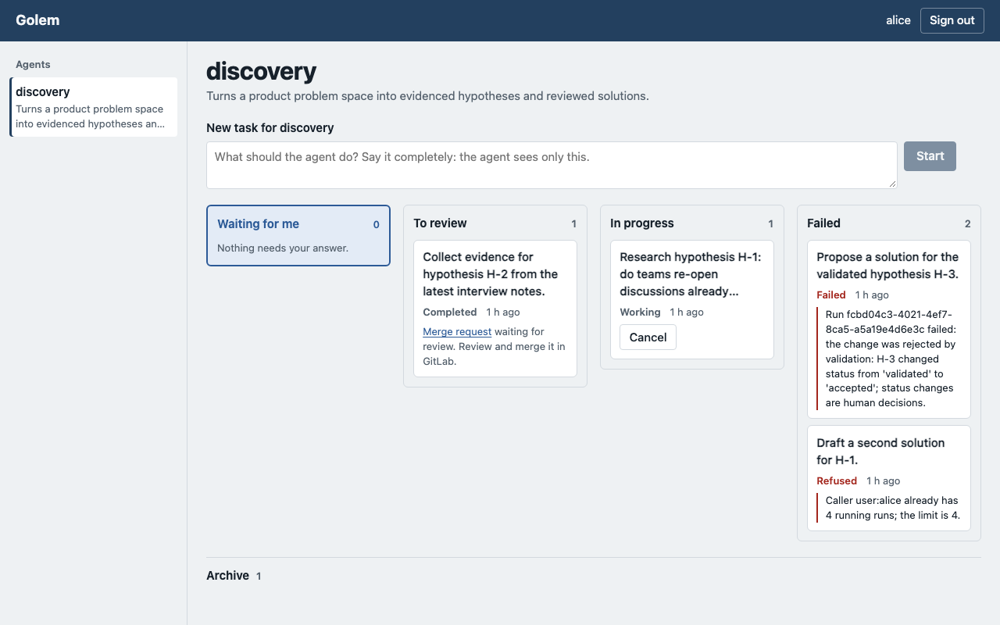
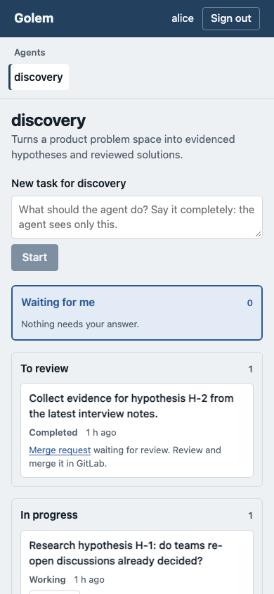

# Getting started

The fastest way to your first result: give an agent a goal on its board, watch the card move,
and open the merge request it proposes. You need an account at your organization's identity
provider that may use Golem, and the UI's address from your platform team (below,
`https://golem-ui.internal`). No other set-up.

The screenshots come from `scripts/ui_demo.py`, the real board with an example agent; yours
shows your agents and your tasks.

## 1. Sign in

Open the UI's address and choose **Sign in**. You sign in at the identity provider as you do
for other internal tools, and come back to the board.

The board never shows or stores a password, and your browser never holds a token: the UI's
backend keeps your session for twelve hours at most, and **Sign out** ends it at once.

## 2. Pick an agent

The column on the left lists the agents you may use, with what each one does. Choose one to
open its board; if there is only one, its board opens by itself.

An agent works on one repository of records, its **context repository**: for the example
agent `discovery`, product hypotheses and solutions. Each run does one step on one record:
the researcher fills a hypothesis's evidence, the designer proposes a solution for a
validated hypothesis, the reviewer reviews a proposed solution. The agent picks the next record
that needs that step; you do not choose it.

## 3. Write a goal and start

Write the goal in **New task for discovery** at the top of the board and choose **Start**.

The goal is what the agent's role reads first: say what you want considered and where to
look ("from the support tickets of the last quarter"). It does not pick the record: the agent
works on the next record that needs work, which may be another one than you named. Choosing
**Start** twice starts one run.

## 4. Watch the board

Each of your tasks for this agent is a card, in the column of what it needs next:

| Column | Holds | What you do |
| --- | --- | --- |
| **Waiting for me** | tasks that need your answer | answer on the card |
| **To review** | completed tasks whose merge request is still open | open the merge request and decide |
| **In progress** | submitted and working tasks | wait; a run takes minutes, at most the platform's deadline (an hour by default). **Cancel** stops it |
| **Failed** | runs that ended without a proposal, and runs that were refused; the card says why | read the reason; tell the agent's author if it is the agent's mistake, the platform team otherwise |
| **Archive** (folded) | canceled tasks, and completed ones whose merge request was merged or closed, or that had nothing to propose | nothing; **Show older tasks** loads more |

The board updates itself about every ten seconds while its tab is visible; you do not reload
it. It shows your last hundred tasks for the agent; older ones are in the archive. Choose a
card's goal to open the task: its state, the messages, and any result.

## 5. Open the merge request

A completed task's card links its merge request, and stays in **To review** until the merge
request is merged or closed.

The merge request is in the agent's context repository, from a branch
`golem/<record>/<run>`, and changes one record: for the researcher, the `Evidence` section of
one hypothesis. The task is complete when the proposal exists; whether it becomes part of the
record is a person's decision, taken in GitLab.

A task that says "succeeded and proposed no changes" found nothing to do: every record that
needs a step already has a proposal waiting for a decision.

## 6. Accept or reject

Accepting is merging the merge request; rejecting is closing it and recording the decision on
the record. Who may do either, and how to do it so the agent does not propose the same thing
again: [reviewing-proposals.md](reviewing-proposals.md).

## When something goes wrong

A failed run says why. This one's role changed a status, which only people may do, so nothing
was proposed:

A refused run was never started; here the caller had four runs going, the limit:

A canceled task shows no outcome:

Starting many tasks within a minute is limited; the form says when to try again, and keeps
the goal you wrote:

The board works on a phone, one column under another:

Tasks started from Jira or Mattermost are not on your board: they belong to the channel, and
the outcome comes back there ([channels.md](channels.md)). Programs can do everything the board
does over A2A with your own token ([install.md, step 10](../operations/install.md#10-first-run)).
