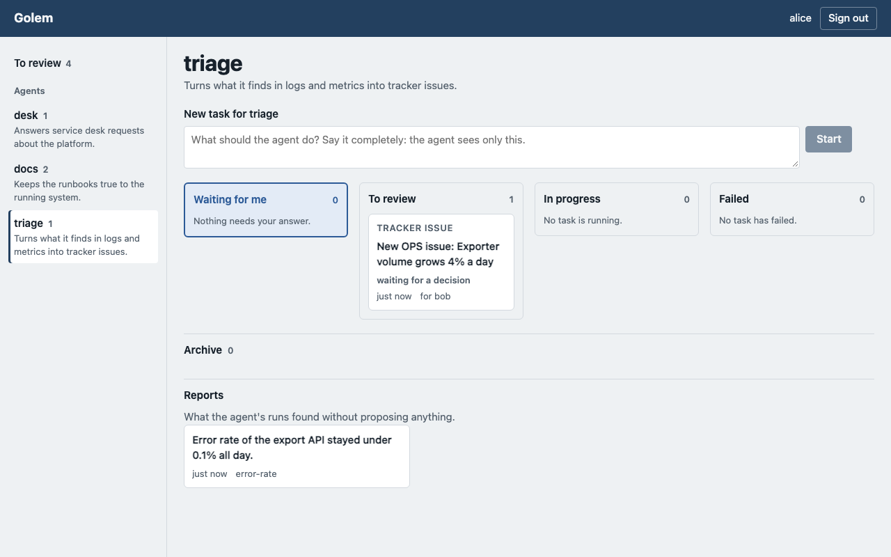

# Reviewing proposals

For gate owners: the people who decide whether an agent's proposal becomes real. Golem only
proposes. A run changes nothing outside its Job: nothing reaches the default branch of a context
repository without a person merging it, and nothing reaches Confluence, a service desk request
or Jira without a person accepting it on the board
([ADR 0004](../adr/0004-security-boundary-outside-the-job.md),
[ADR 0015](../adr/0015-proposals.md)).

## Two ways to decide

An agent's catalog says what its runs propose:

| Kind | A run proposes | You decide | The platform then |
| --- | --- | --- | --- |
| merge request (the default) | a change to its context repository | in GitLab: merge or close | follows the merge request |
| page edit | a new body for one Confluence page | on the board: **Accept** or **Reject** | writes the page |
| service desk reply | a reply to one request, for the customer or internal | on the board | posts the reply |
| tracker issue | a new Jira issue, or a comment on one | on the board | creates the issue or the comment |

Merge requests are described [below](#merge-requests). The other three are decided on the
board, the same way.

## Who decides

The person who started the run, and the agent's **reviewers**: people named in its catalog
(`reviewers: [user:<name>]`). Reviewers matter for runs nobody started by hand: an alert, a
schedule or a chat channel starts them as a service, and the proposal waits for a reviewer.
A reviewer sees the proposal and the run's report, never the rest of the task. Everyone else
gets "not found".

## Where you find what waits

**To review** at the top of the left column counts what waits for you, per agent next to each
agent's name; it opens a queue across all your agents. On an agent's board, **To review** holds
your own completed tasks with an open proposal, and, as cards of their own, proposals you decide
as a reviewer ("for bob"). The counts refresh every minute, the board every ten seconds.

## Deciding on the board

Open the proposal. Its page shows what would be written, as text, never rendered:

- a **page edit** as the changes to the page **as it is now**: removed lines struck through,
  added lines marked, long unchanged stretches folded. The platform reads the live page for
  this, not the run's copy, so you see what accepting really changes;
- a **reply** with its request and who reads it: **the customer**, or **agents only** for an
  internal note;
- a **tracker issue** with its project, type, summary and description, or the issue and the
  comment;
- **What the run found**: the run's report, when it left one.

**Accept** applies it at once, as you. The page says what came of it:

| It says | Meaning | What you do |
| --- | --- | --- |
| Accepted and applied. | written to Confluence, the request or Jira | nothing |
| being applied | the target did not answer in time; the platform retries within minutes | nothing; the board shows when it is done |
| its target changed | the page moved to another version since the run read it; nothing was written | nothing; a new run redoes it on the current page |
| could not be applied: … | the target refused, with its reason (for example a space the platform may not write to) | accept again once fixed, or reject |

**Reject** writes nothing. The reason is optional, except on a stage of a process, where the
stage runs again with it. If someone decided first, the page says so and shows the proposal as
it is now.

An accepted proposal's record lands in the agent's context repository by itself: the platform
merges the run's branch at the commit you accepted.

## Reports

A run that found nothing to propose leaves a report. Each board has a **Reports** lane below
the archive, folded; open it to read what the agent's quiet runs found. Reviewers read the
reports of the agents they review.

## Merge requests

One run, one merge request in the agent's context repository:

| Part | Looks like |
| --- | --- |
| source branch | `golem/<record id>/<run id>`, for example `golem/H-2/93ebcf70-752f-4ed5-b347-723c0928354e` |
| target branch | the one named for the agent in the platform's configuration (usually `main`) |
| title | `<agent>: <record id>`, for example `discovery: H-2` |
| description | `Proposed by agent <agent> in run <run id> for <record id>.` |
| author | the platform's bot account |
| commits | one: `golem: <role> on <record id>`, the role's summary, and the trailers `Run:`, `Role:`, `Target:` |
| "delete source branch" | set: merging removes the branch |

The run id leads to the run's task, trace and audit rows (ask the platform team). The role's
summary in the commit message is its own account of what it did.

### Where you find it

On the board ([getting-started.md](getting-started.md)), a task whose run opened a merge
request sits in **To review**, with a link to the merge request. The decision itself is taken
in GitLab: the board has no merge or close button for merge requests. The platform reads the
merge request's state back from GitLab every few minutes (`GOLEM_MR_POLL_SECONDS`, five by
default); once it is merged or closed, the card moves to the archive.

### What validation already guarantees

Before the branch was pushed, the change passed every check of
[writing-an-agent.md](writing-an-agent.md#what-validation-checks):

- every changed file is in the role's directory (the researcher's in `hypotheses/`);
- the repository still parses: front matter, unique ids, links to existing records;
- no record's `status` changed;
- the target record, or a new record linking to it, changed.

What it does **not** check is whether the content is right: whether the evidence exists, the
sources are real, the reasoning holds. That is the review. Read the linked sources; a role is
told not to invent them, but a model can.

### Accept

Merge the merge request (after your project's approvals). The branch is deleted, so the record
is no longer pending, and the next run works from the new content: a hypothesis with its
evidence filled is no longer the researcher's target.

Then make the human decision the proposal prepares, if there is one: a researcher's evidence
may justify `status: validated` or `status: rejected` on the hypothesis, a reviewer's review
`accepted` or `rejected` on the solution. Change the `status` in the record, in a merge request
of your own or with a commit of your own on the proposal's branch before merging. Only people
change statuses; a run that tries fails validation.

### Reject

Record the decision on the record, then get rid of the proposal:

1. **Change the record's status** to what your decision means (`rejected` for a refuted
   hypothesis or a solution you will not build), in a merge request of your own. This is what
   stops the agent: the rules no longer match the record.
2. **Close the proposal's merge request and delete its branch** (the "Delete source branch"
   button on the closed merge request, or `git push origin --delete golem/<record id>/<run id>`).

Why both: the agent treats a record as pending while a `golem/<record id>/...` branch exists
([runtime/workspace.py](../../src/golem/runtime/workspace.py)). **Closing the merge request
alone keeps the branch**, so the record stays pending for ever: no decision is recorded and
the agent never looks at it again. Deleting the branch alone makes the record free again, and
the next run proposes the same step once more. Only the status change records a decision.

### A wrong proposal

Wrong content, and you want another attempt:

- close the merge request and delete the branch; the next run takes the record again;
- write a comment on what was wrong for the agent's author; a repeated mistake belongs in the
  agent's golden set as a case, so the gate catches it
  ([writing-an-agent.md](writing-an-agent.md#the-golden-set)).

Wrong content, and nobody should work on the record: change its status as in
[Reject](#reject).

A proposal that should not exist at all (another directory, a changed status, secrets in the
text): validation should have stopped the first two, so tell the platform team with the run id.

## A stage of a process

A process's stage proposes a merge request like any run, and your decision on it drives the
process ([ADR 0019](../adr/0019-processes.md)):

- **Merge** it: the next stage starts once the platform has read the merge request's state
  back from GitLab (every `GOLEM_MR_POLL_SECONDS`, five minutes by default), and reads what you
  merged. After the last stage, the process is done.
- **Close it with a comment** saying what is wrong: the same stage runs again, with your
  comment as its brief. The platform takes the last comment you wrote on the merge request,
  up to a minute after closing it. A stage runs at most `1 + return_limit` times (three by
  default); after that the process fails.
- **Close it without a comment**: the process waits. Its card goes to **Waiting for me** on the
  board, with a field for the reason. Write it and choose **Rerun the stage**, which counts as
  one attempt, or **End the process**, which ends it as failed.

If the record under a stage changed before you decided, the stage's proposal is out of date and
the stage runs again by itself; that does not use up your attempts, but a process gives up
after three such reruns of one stage.

Only the person who started the process answers on its card; **Cancel** stops the process and
closes the stage's open merge request.

## Rules of thumb

- One merge request per record at a time: while one is open, the agent works on other records.
  An old open proposal blocks its record; decide it or close it.
- Edit the proposal's branch freely before merging (fix a phrase, add a source); the agent
  never touches a branch after pushing it.
- Merge conflicts mean the record changed since the run; close the proposal and delete its
  branch, and a new run starts from the current record.
